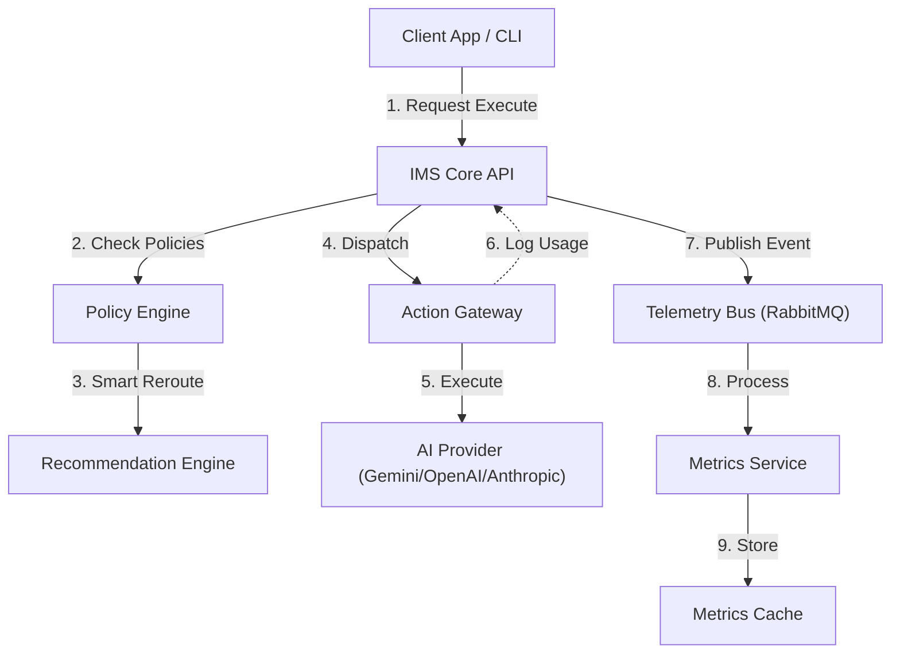

# 🤖 IMS Core - Intelligent Model Selector

[](LICENSE)
[](#releases)
[](https://www.python.org/)
[](#status)

**The central nervous system for AI model orchestration. IMS intelligently routes prompts to the most cost-effective and capable model for the task.**

---

## 🚀 Overview

The **Intelligent Model Selector (IMS)** is a production-grade service that decouples applications from specific AI providers. Instead of hardcoding `gpt-4` or `claude-3`, applications query IMS for a recommendation based on:
- **Cost constraints** (e.g., "max $0.01 per query")
- **Capability requirements** (e.g., "needs complex reasoning")
- **Context window** (e.g., "needs 100k+ tokens")
- **Governance policies** (e.g., "use approved vendors only")

IMS handles the complexity of model selection, policy enforcement, usage tracking, and error recovery, providing a unified "Action Gateway" for your AI ecosystem.

---

## ✨ Key Features

### 🛡️ Policy Enforcement (Epic 4)
- **Technical Guardrails**: Enforce prompt length and output limits to prevent system overloads.
- **No Content Censorship**: IMS is a technical orchestrator, not a content police. It does not perform keyword or sentiment filtering.
- **Smart Model Routing**: Automatically downgrades requests to cheaper models in the same capability tier if they exceed budget limits.
- **Permission Bypassing**: Users can explicitly override budget blocks using the `bypass_policies` flag.

### 🧠 Intelligent Routing (PCR)
- **Pattern Completion & Recommendation (PCR)** engine.
- Dynamically selects models based on strategy (`cost` vs `performance`).
- Filters by context window, capabilities, and active status.

### 🔌 Action Gateway (Epic 3)
- **Unified multi-vendor execution** (Google, OpenAI, Anthropic).
- Automatic request/response normalization.
- **Error Recovery**: Circuit Breaker pattern and automatic fallback logic.

### 📡 Observability & Telemetry
- **Telemetry Bus**: RabbitMQ-based event streaming for real-time monitoring.
- **Compliance API**: Full audit trail of all policy decisions and executions.
- **Health Dashboard**: Live CLI dashboard for system status.

---

## 🏗️ Architecture



---

## 🚀 Quick Start

### Prerequisites
- Docker & Docker Compose
- Python 3.12+

### 1. Installation

```bash
# Clone the repository
git clone https://github.com/StewardshipAI/ims-core-dev.git
cd ims-core-dev

# Run the automated setup (deploys DB, Redis, RabbitMQ, API)
chmod +x scripts/setup-midpoint.sh
./scripts/setup-midpoint.sh
```

### 2. Usage Example (API)

```bash
# Execute with smart routing and permission bypass
curl -X POST http://localhost:8000/api/v1/execute \
  -H "Content-Type: application/json" \
  -H "X-Admin-Key: YOUR_ADMIN_KEY" \
  -d '{
    "prompt": "Analyze this data...",
    "model_id": "gpt-4o",
    "bypass_policies": true
  }'
```

---

## 📊 Project Status

| Milestone | Component | Status | Description |
|-----------|-----------|--------|-------------|
| **Epic 1** | Foundation | ✅ Complete | Registry, API, Telemetry Bus |
| **Epic 2** | Intelligence | ✅ Complete | PCR Engine, State Machine |
| **Epic 3** | Action Gateway | ✅ Complete | Multi-vendor execution adapters |
| **Epic 4** | Policy Engine | ✅ Complete | Smart Routing, Budget Limits, Overrides |
| **Epic 5** | Analytics | 🔄 In Progress | Advanced reporting and cost optimization |

---

## 📚 Documentation

- **[Epic 4: Policy Enforcement](docs/ims/IMS-EPIC-4-POLICY-ENFORCEMENT.md)**: Details on PVE and BCP logic.
- **[Epic 3: Action Gateway](docs/ims/IMS-EPIC-3-ACTION-GATEWAY.md)**: Vendor adapter implementation.
- **[Epic 2: Intelligence Layer](docs/ims/IMS-EPIC-2-INTELLIGENCE.md)**: PCR and State Machine logic.
- **[Epic 1: Foundation](docs/ims/IMS-EPIC-1-FOUNDATION.md)**: Registry and Infrastructure.

---

## 🤝 Contributing

We welcome contributions! Please see [CONTRIBUTING.md](CONTRIBUTING.md) for details.

---

**Built with ❤️ by StewardshipAI**