# 🧠 IMS Core - Intelligent Model Switching

**Version:** 0.3.0 (Epic 3 - Action Gateway)  
**Status:** 🚀 Production Ready  
**Organization:** StewardshipAI

Enterprise-grade AI orchestration platform for intelligent model switching, cost optimization, and automatic failover across multiple LLM vendors.

---

## 📊 Project Status

### ✅ Epic 1: Foundation (100% Complete)
- ✅ Model Registry with PostgreSQL
- ✅ REST API with FastAPI
- ✅ Redis caching layer
- ✅ RabbitMQ telemetry bus
- ✅ Docker deployment

### ✅ Epic 2: Intelligence Layer (100% Complete)
- ✅ Pattern Completion & Recommendation (PCR)
- ✅ Usage tracking with telemetry
- ✅ Error recovery with fallback
- ✅ State machine orchestration
- ✅ Gemini-CLI integration

### ✅ Epic 3: Action Gateway (100% Complete)
- ✅ Vendor adapter pattern
- ✅ Unified execution interface
- ✅ Real API integration
- ✅ Request/response normalization

## 🚧 In Progress: Epic 4: Policy Enforcement Engine

### Overview
Implement policy verification and enforcement across the IMS platform to ensure compliance with business rules and constraints.

### Components
- 🚧 **Policy Verifier Engine (PVE)**: Core evaluation engine.
- 🚧 **Behavioral Constraint Processor (BCP)**: Real-time guardrail enforcement.
- 🚧 **Audit Logging**: Complete history of policy decisions.
- 🚧 **Compliance Reporting**: Generation of compliance summaries.

### Policy Types
- 🚧 **Cost Constraints**: Budget limits and threshold alerts.
- 🚧 **Performance Requirements**: Latency and accuracy minimums.
- 🚧 **Vendor Restrictions**: Approved/Blocked vendor lists.
- 🚧 **Data Residency**: Regional routing requirements.
- 🚧 **Behavioral Guardrails**: Content safety and formatting rules.

### Tasks
- [ ] Implement policy evaluator
- [ ] Build constraint checker
- [ ] Add audit logging
- [ ] Create compliance reports
- [ ] Integration with Agent Control Flow (ACF)
- [ ] Write comprehensive tests

---

## 🏗️ System Architecture


---

## 🔄 Request Flow

```mermaid
sequenceDiagram
    participant User
    participant CLI as ims-gemini.sh
    participant API as FastAPI
    participant PCR as Recommendation
    participant State as State Machine
    participant Gateway as Action Gateway
    participant Adapter as Vendor Adapter
    participant Tracker as Usage Tracker
    participant Vendor as External API

    User->>CLI: Execute command
    CLI->>API: POST /api/v1/recommend
    API->>PCR: Get recommendation
    PCR->>State: Create workflow
    State->>State: IDLE → SELECTING_MODEL
    State-->>PCR: Model selected
    PCR-->>API: Return model recommendation
    API-->>CLI: Selected model
    CLI->>API: POST /api/v1/execute
    API->>State: SELECTING_MODEL → EXECUTING
    State->>Gateway: Execute with model
    Gateway->>Adapter: Normalize request
    Adapter->>Vendor: API call
    Vendor-->>Adapter: Response
    Adapter->>Tracker: Log usage
    Tracker->>Tracker: Calculate cost
    Adapter-->>Gateway: Normalized response
    Gateway-->>State: Execution complete
    State->>State: EXECUTING → VALIDATING
    State->>State: VALIDATING → COMPLETED
    State-->>API: Final result
    API-->>CLI: Response
    CLI-->>User: Display result
```



---

## ✨ Key Features

### Cost Optimization
- 🎯 **Smart Model Selection** - Choose cheapest capable model
- 📊 **Real-time Cost Tracking** - Monitor token usage and costs
- 💰 **Free Tier First** - Prioritize free/cheaper models
- 📉 **Cost Analytics** - Historical spending insights

### Reliability
- 🔄 **Automatic Fallback** - Switch models on failure
- ⚡ **Circuit Breaker** - Prevent cascade failures
- 🔁 **Exponential Backoff** - Smart retry logic
- 🛡️ **Error Recovery** - Graceful degradation

### Observability
- 📡 **Telemetry Events** - Real-time event streaming
- 📈 **Usage Metrics** - Token, cost, and latency tracking
- 🏥 **Health Monitoring** - System status dashboard
- 📝 **Audit Trail** - Complete decision history

### Developer Experience
- 🔌 **CLI Integration** - Works with gemini-cli, openai-cli
- 🐍 **Python SDK** - Native Python library
- 📚 **OpenAPI Docs** - Auto-generated API docs
- 🧪 **Comprehensive Tests** - Unit + integration tests

---

## 🚀 Quick Start

### Prerequisites
- Docker & Docker Compose
- Python 3.11+
- API Keys (Gemini, OpenAI, or Anthropic)

### Installation (Docker)

```bash
# Clone repository
git clone https://github.com/StewardshipAI/ims-core-dev.git
cd ims-core-dev

# Configure environment
cp .env.example .env
# Edit .env with your API keys

# Start services
docker-compose up -d

# Verify health
curl http://localhost:8000/health

# Seed models
./scripts/seed-models.sh

# Test integration
./scripts/ims-gemini.sh "What is 2+2?"
```

### API Usage

```bash
# Get model recommendation
curl -X POST http://localhost:8000/api/v1/recommend \
  -H "Content-Type: application/json" \
  -H "X-Admin-Key: $ADMIN_API_KEY" \
  -d '{
    "strategy": "cost",
    "min_context_window": 50000
  }'

# Execute with selected model (Epic 3)
curl -X POST http://localhost:8000/api/v1/execute \
  -H "Content-Type: application/json" \
  -H "X-Admin-Key: $ADMIN_API_KEY" \
  -d '{
    "prompt": "Explain quantum computing",
    "model_id": "gemini-2.5-flash",
    "max_tokens": 1000
  }'

# Check usage metrics
curl http://localhost:8000/metrics \
  -H "X-Admin-Key: $ADMIN_API_KEY"
```

---

## 📚 Documentation

- **[Epic 1 Documentation](docs/ims/IMS-EPIC-1-FOUNDATION.md)** - Model Registry & API
- **[Epic 2 Documentation](docs/ims/IMS-EPIC-2-INTELLIGENCE.md)** - PCR & State Machine
- **[Epic 3 Documentation](docs/ims/IMS-EPIC-3-ACTION-GATEWAY.md)** - Vendor Adapters
- **[API Reference](http://localhost:8000/docs)** - Swagger UI
- **[Architecture Guide](docs/ARCHITECTURE.md)** - System design

---

## 🏭 Production Deployment

### Docker Compose (Recommended)

```bash
# Production configuration
docker-compose -f docker-compose.prod.yml up -d

# With SSL/TLS (nginx reverse proxy)
# See docs/DEPLOYMENT.md for complete guide
```

### Manual Deployment

```bash
# Create virtual environment
python -m venv venv
source venv/bin/activate

# Install dependencies
pip install -r requirements.txt

# Run migrations
psql -d ims_db -f schemas/model_registry.sql

# Start services
uvicorn src.api.model_registry_api:app --host 0.0.0.0 --port 8000 --workers 4
```

---

## 🧪 Testing

```bash
# Run all tests
pytest tests/ -v

# Run with coverage
pytest tests/ -v --cov=src --cov-report=html

# Integration tests only
pytest tests/test_integration.py -v

# Epic 3 tests
pytest tests/test_gateway.py -v
```

---

## 📊 Monitoring

### Health Dashboard

```bash
# Real-time status
./scripts/ims-status.sh

# Single snapshot
./scripts/ims-status.sh --once
```

### Metrics Endpoint

```bash
# Get current metrics
curl http://localhost:8000/metrics \
  -H "X-Admin-Key: $ADMIN_API_KEY" | jq
```

### RabbitMQ Management

```
http://localhost:15672
Username: guest
Password: guest
```

---

## 🔐 Security

### API Authentication
- Admin endpoints require `X-Admin-Key` header
- Keys must be 32+ characters
- Generate with: `openssl rand -hex 32`

### Environment Variables
```bash
# Required
ADMIN_API_KEY=<strong-random-key>
GOOGLE_API_KEY=<your-gemini-key>
OPENAI_API_KEY=<your-openai-key>
ANTHROPIC_API_KEY=<your-claude-key>

# Optional
DB_CONNECTION_STRING=postgresql://...
REDIS_URL=redis://...
RABBITMQ_URL=amqp://...
```

### CORS Configuration
```python
# .env
ALLOWED_ORIGINS=http://localhost:3000,https://your-domain.com
```

---

## 🗺️ Roadmap

| Milestone | Component | Status | Description |
|-----------|-----------|--------|-------------|
| **Epic 1** | Model Registry | ✅ Complete | Database, API, Caching |
| **Epic 1** | Telemetry Bus | ✅ Complete | RabbitMQ, Event Publishers |
| **Epic 1** | Metrics Store | ✅ Complete | Redis-backed usage stats |
| **Epic 2** | PCR Engine | ✅ Complete | Recommendation logic |
| **Epic 2** | ACF Core | ✅ Complete | State machine, Error recovery |
| **Epic 2** | Integration | ✅ Complete | CLI wrappers, Health dashboard |
| **Epic 3** | Action Gateway | ✅ Complete | Unified multi-vendor execution (Google, OpenAI, Anthropic) |
| **Epic 4** | Policy Enforcement | 🔄 In Progress | Compliance, Guardrails, and Budget Limits |

---


---

## 🤝 Contributing

We welcome contributions! See [CONTRIBUTING.md](CONTRIBUTING.md) for guidelines.

### Development Setup

```bash
# Clone repo
git clone https://github.com/StewardshipAI/ims-core-dev.git
cd ims-core-dev

# Install dev dependencies
pip install -r requirements-dev.txt

# Run tests
pytest tests/ -v

# Format code
black src/ tests/
isort src/ tests/

# Type check
mypy src/
```

---

## 📄 License

Apache 2.0 - See [LICENSE](LICENSE) file

---

## 📧 Support

- **Issues:** [GitHub Issues](https://github.com/StewardshipAI/ims-core-dev/issues)
- **Documentation:** [docs/](docs/)
- **Community:** [Discord](https://discord.gg/stewardshipsolutions)

---

## 🏆 Credits

**Built by:** StewardshipAI Team  
**Lead Developer:** Nathan  
**AI Assistant:** Claude 4.5 Sonnet (Anthropic) & Gemini 3 flash (Google) 
**Organization:** StewardshipAI

---

## 📈 Stats


---

**Built with ❤️ by StewardshipAI**

*Making AI orchestration simple, reliable, and cost-effective.*
