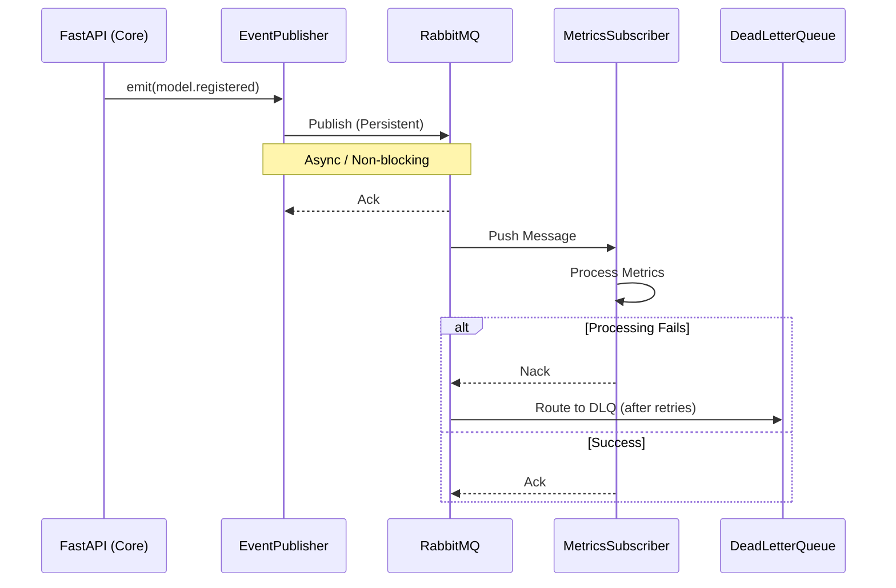

# SPEC-EPIC-1.3: Telemetry Bus Architecture

**Version**: 1.0.0
**Status**: DRAFT (Pending Audit)
**Date**: 2025-12-26
**Epic**: 1.3 Telemetry Bus

---

## 1. Executive Summary

This specification defines the architecture for the **IMS Telemetry Bus**, a high-performance, asynchronous event streaming backbone powered by **RabbitMQ**. It is designed to decouple the IMS Core API from peripheral subsystems (metrics, logging, audit) while ensuring **zero data loss** and **<1ms API latency overhead**.

## 2. System Architecture

### 2.1 High-Level Design

The system adopts a **Reliable Publisher / Durable Subscriber** pattern.



### 2.2 Technology Stack

| Component | Technology | Justification |
|-----------|------------|---------------|
| **Broker** | RabbitMQ 3.12+ | Proven enterprise reliability, advanced routing (Topic Exchanges). |
| **Client** | `aio-pika` | Native asyncio support for Python/FastAPI, connection robustness. |
| **Format** | JSON | Human-readable, flexible schema for diverse event types. |
| **Container** | Docker | Consistent deployment, easy orchestration. |

---

## 3. Component Specifications

### 3.1 RabbitMQ Configuration (Infrastructure)

The infrastructure must be declared as code (IaC) via the application on startup or via Terraform (out of scope, using app-startup for now).

*   **VHost**: `/` (Default)
*   **Exchanges**:
    *   `models.events` (Topic, Durable): For all model lifecycle events.
    *   `metrics.events` (Topic, Durable): For high-frequency telemetry.
    *   `errors.events` (Topic, Durable): For alerts and system faults.
*   **Policies**:
    *   `ha-mode: all` (High Availability for clustered setups - future proofing).

### 3.2 The Publisher (IMS-Core)

The publisher is an injected dependency within the FastAPI application.

**Key Requirements:**
1.  **Connection Pooling**: Managed via `FastAPI.lifespan`.
2.  **Channel Strategy**: Single shared channel for publishing (thread-safe in `aio-pika`).
3.  **Resilience**: `connect_robust` with automatic reconnection backoff.
4.  **Performance**: Fire-and-forget (with optional confirmation for critical events).

**Interface:**
```python
await publisher.publish(
    event_type="model.registered",
    data={...},
    correlation_id=ctx.request_id
)
```

### 3.3 The Subscriber (Metrics Service)

A standalone background service (or separate container) that consumes the queue.

*   **Concurrency**: `aio-pika` consumer with `prefetch_count=10` to balance load.
*   **Idempotency**: Processing logic must handle duplicate deliveries (at-least-once delivery guarantee).
*   **Error Handling**:
    *   Transient Error → Nack (Requeue).
    *   Permanent Error → Nack (No Requeue) → DLQ.

---

## 4. Data Specifications

### 4.1 Event Schema

All events must adhere to this strict JSON structure:

```json
{
  "specversion": "1.0",
  "id": "550e8400-e29b-41d4-a716-446655440000",
  "source": "/ims/api/models",
  "type": "model.registered",
  "time": "2025-12-26T12:00:00Z",
  "correlation_id": "req-12345",
  "datacontenttype": "application/json",
  "data": {
    "model_id": "gpt-4",
    "vendor": "openai"
  }
}
```
*Adopts CloudEvents 1.0 standard naming conventions.*

### 4.2 Queue Topology & Routing

| Exchange | Routing Key | Queue | Feature |
|----------|-------------|-------|---------|
| `models.events` | `model.*` | `audit.trail` | Persistent storage of all changes. |
| `models.events` | `model.registered` | `metrics.updates` | Increment "Registered Models" counter. |
| `metrics.events` | `api.latency` | `metrics.updates` | Histogram update. |
| `errors.events` | `*` | `alerts.critical` | Slack/PagerDuty trigger. |

---

## 5. Security & Compliance

1.  **Transport Security**: AMQPS (TLS) must be supported (config flag).
2.  **Authentication**: Username/Password via Environment Variables (`RABBITMQ_USER`, `RABBITMQ_PASS`).
3.  **Audit**: All `models.*` events are routed to a permanent audit log queue.

## 6. Development Plan

1.  **Phase 1**: Infrastructure (RabbitMQ container).
2.  **Phase 2**: Publisher Implementation (Core API integration).
3.  **Phase 3**: Subscriber Implementation (Metrics collection).
4.  **Phase 4**: Verification (Load tests).

---

**Audit Checklist**:
- [ ] Does this meet the "Reliability" goal? Yes (Durable queues, DLQ).
- [ ] Is it "Non-blocking"? Yes (Asyncio).
- [ ] Is it "Enterprise-grade"? Yes (CloudEvents schema, Robust connection, HA policies).
