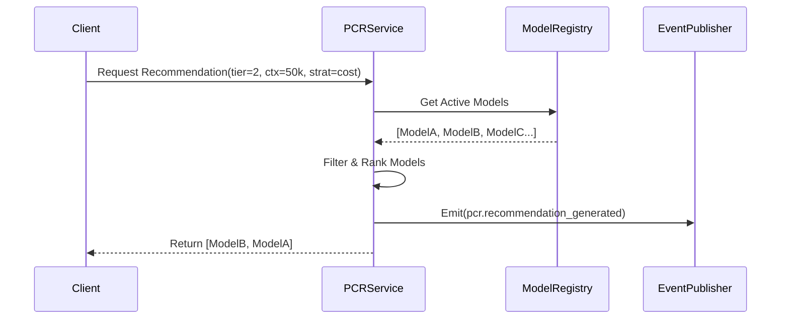

# SPEC-EPIC-1.4: Pattern Completion & Recommendation (PCR)

**Version**: 1.0.0
**Status**: DRAFT
**Date**: 2025-12-26
**Epic**: 1.4 PCR

---

## 1. Executive Summary

The **PCR (Pattern Completion & Recommendation)** engine is the decision-making layer of IMS. For version 1.0, it provides a **heuristic-based recommendation engine** that selects the optimal AI model for a given task based on constraints (context window, cost) and preferences (performance vs. cost).

## 2. System Architecture

### 2.1 Component Interaction

The PCR Service acts as a logic layer over the Model Registry.



## 3. Detailed Design

### 3.1 Recommendation Algorithm (Heuristic)

The selection process follows a funnel approach:

1.  **Hard Filters** (Must pass):
    *   `is_active == True`
    *   `context_window >= requested_context`
    *   `capability_tier >= requested_tier` (where Tier 3 > Tier 2 > Tier 1)
    
2.  **Soft Ranking** (Optimization):
    *   **Strategy: Cost** → Sort by `(cost_in + cost_out) / 2` ascending.
    *   **Strategy: Performance** → Sort by `Tier` desc, then `Context` desc.
    *   **Strategy: Balanced** → (Future) Weighted score. For now, defaults to Cost.

### 3.2 Data Models

**Request:**
```json
{
  "min_capability_tier": "Tier_2",
  "min_context_window": 16000,
  "strategy": "cost"
}
```

**Response:**
List of standard `ModelResponse` objects, ordered by rank.

## 4. API Specification

**Endpoint**: `POST /api/v1/recommend`

**Headers**:
- `X-Admin-Key`: Required (for now, eventually public with rate limits).

**Success (200 OK)**:
Returns JSON list of recommended models.

**Events**:
Emits `pcr.recommendation_generated` with:
- `inputs`: The criteria used.
- `match_count`: Number of models found.
- `top_match`: ID of the #1 result.

## 5. Development Plan

1.  **Core Logic**: Implement `src/core/pcr.py`.
2.  **API Layer**: Implement `src/api/pcr_router.py`.
3.  **Integration**: Mount router in `main.py`.
4.  **Testing**: Unit tests for ranking logic.

---

**Audit Checklist**:
- [ ] Does it support the "Cheapest Model" goal? Yes.
- [ ] Is it decoupled from the Registry? Yes, uses Registry as data source.
- [ ] Is it observable? Yes, emits events.
